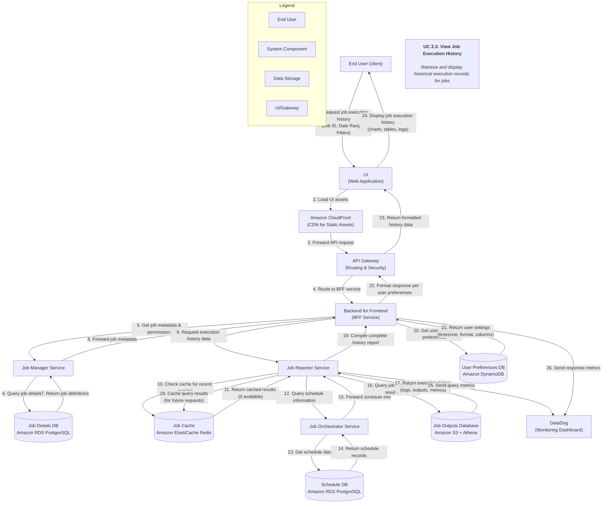

# Data Flow Diagram for UC 2.3: View Job Execution History

```mermaid
flowchart TB
 subgraph Legend["Legend"]
        L1["End User"]
        L2["System Component"]
        L3["Data Storage"]
        L4["UI/Gateway"]
  end
    User["End User (client)"] -- "1. Request job execution history<br>(Job ID, Date Range, Filters)" --> UI["UI<br>(Web Application)"]
    UI -- "2. Load UI assets" --> CloudFront["Amazon CloudFront<br>(CDN for Static Assets)"]
    CloudFront -- "3. Forward API request" --> APIGateway["API Gateway<br>(Routing &amp; Security)"]
    APIGateway -- "4. Route to BFF service" --> BFF["Backend for Frontend<br>(BFF Service)"]
    BFF -- "5. Get job metadata & permissions" --> JobManager["Job Manager Service"]
    JobManager -- "6. Query job details" --> JobDetailsDB[("Job Details DB<br>Amazon RDS PostgreSQL")]
    JobDetailsDB -- "7. Return job definitions" --> JobManager
    JobManager -- "8. Forward job metadata" --> BFF
    BFF -- "9. Request execution history data" --> JobReporter["Job Reporter Service"]
    JobReporter -- "10. Check cache for recent queries" --> ElastiCache[("Job Cache<br>Amazon ElastiCache Redis")]
    ElastiCache -- "11. Return cached results (if available)" --> JobReporter
    JobReporter -- "12. Query schedule information" --> JobOrchestrator["Job Orchestrator Service"]
    JobOrchestrator -- "13. Get schedule data" --> ScheduleDB[("Schedule DB<br>Amazon RDS PostgreSQL")]
    ScheduleDB -- "14. Return schedule records" --> JobOrchestrator
    JobOrchestrator -- "15. Forward schedule info" --> JobReporter
    JobReporter -- "16. Query job execution results" --> JobOutputsDB[("Job Outputs Database<br>Amazon S3 + Athena")]
    JobOutputsDB -- "17. Return execution history<br>(logs, outputs, metrics)" --> JobReporter
    JobReporter -- "18. Cache query results<br>(for future requests)" --> ElastiCache
    JobReporter -- "19. Compile complete history report" --> BFF
    BFF -- "20. Get user display preferences" --> DynamoDB[("User Preferences DB<br>Amazon DynamoDB")]
    DynamoDB -- "21. Return user settings<br>(timezone, format, columns)" --> BFF
    BFF -- "22. Format response per user preferences" --> APIGateway
    APIGateway -- "23. Return formatted history data" --> UI
    UI -- "24. Display job execution history<br>(charts, tables, logs)" --> User
    JobReporter -- "25. Send query metrics" --> CloudWatch["DataDog<br>(Monitoring Dashboard)"]
    BFF -- "26. Send response metrics" --> CloudWatch
    title["<b>UC 2.3: View Job Execution History</b><br><br><i>Retrieve and display historical execution records for jobs</i>"]
```
