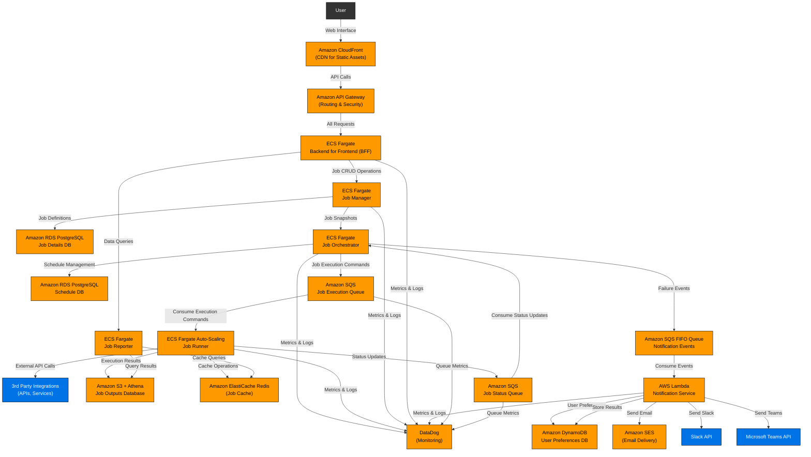

# Infrastructure Diagram

```mermaid
graph TD
    %% User Interaction Layer
    User["User"] -->|Web Interface| CloudFront["Amazon CloudFront<br/>(CDN for Static Assets)"]
    
    %% API Gateway & BFF Layer
    CloudFront -->|API Calls| APIGateway["Amazon API Gateway<br/>(Routing & Security)"]
    APIGateway -->|All Requests| BFF["ECS Fargate<br/>Backend for Frontend (BFF)"]
    
    %% Job Management Layer
    BFF -->|Job CRUD Operations| JobManager["ECS Fargate<br/>Job Manager"]
    JobManager -->|Job Definitions| JobDetailsDB["Amazon RDS PostgreSQL<br/>Job Details DB"]
    JobManager -->|Job Snapshots| JobOrchestrator["ECS Fargate<br/>Job Orchestrator"]
    
    %% Job Orchestration & Execution
    JobOrchestrator -->|Schedule Management| ScheduleDB["Amazon RDS PostgreSQL<br/>Schedule DB"]
    JobOrchestrator -->|Job Execution Commands| JobExecutionQueue["Amazon SQS<br/>Job Execution Queue"]
    JobOrchestrator -->|Failure Events| NotificationQueue["Amazon SQS FIFO Queue<br/>Notification Events"]
    
    %% Job Execution Layer
    JobExecutionQueue -->|Consume Execution Commands| JobRunner["ECS Fargate Auto-Scaling<br/>Job Runner"]
    JobRunner -->|External API Calls| Integrations["3rd Party Integrations<br/>(APIs, Services)"]
    JobRunner -->|Execution Results| JobOutputsDB["Amazon S3 + Athena<br/>Job Outputs Database"]
    JobRunner -->|Cache Operations| ElastiCache["Amazon ElastiCache Redis<br/>(Job Cache)"]
    JobRunner -->|Status Updates| JobStatusQueue["Amazon SQS<br/>Job Status Queue"]
    
    %% Status Feedback Loop
    JobStatusQueue -->|Consume Status Updates| JobOrchestrator
    
    %% Reporting Layer
    BFF -->|Data Queries| JobReporter["ECS Fargate<br/>Job Reporter"]
    JobReporter -->|Query Results| JobOutputsDB
    JobReporter -->|Cache Queries| ElastiCache
    
    %% Notification Layer
    NotificationQueue -->|Consume Events| NotificationLambda["AWS Lambda<br/>Notification Service"]
    NotificationLambda -->|User Preferences| DynamoDB["Amazon DynamoDB<br/>User Preferences DB"]
    NotificationLambda -->|Send Email| SES["Amazon SES<br/>(Email Delivery)"]
    NotificationLambda -->|Send Slack| Slack["Slack API"]
    NotificationLambda -->|Send Teams| Teams["Microsoft Teams API"]
    NotificationLambda -->|Store Results| DynamoDB
    
    %% Monitoring & Observability
    JobOrchestrator -->|Metrics & Logs| CloudWatch["DataDog<br/>(Monitoring)"]
    JobRunner -->|Metrics & Logs| CloudWatch
    JobManager -->|Metrics & Logs| CloudWatch
    BFF -->|Metrics & Logs| CloudWatch
    NotificationLambda -->|Metrics & Logs| CloudWatch
    JobExecutionQueue -->|Queue Metrics| CloudWatch
    JobStatusQueue -->|Queue Metrics| CloudWatch

    %% Styling
    classDef awsService fill:#ff9900,color:#000,stroke:#000
    classDef externalService fill:#0073e6,color:#fff,stroke:#000
    classDef user fill:#333,color:#fff,stroke:#000
    classDef application fill:#28a745,color:#fff,stroke:#000
    
    class CloudFront,APIGateway,BFF,JobManager,JobOrchestrator,JobReporter,JobRunner,RDS,JobDetailsDB,ScheduleDB,JobOutputsDB,SQS,JobExecutionQueue,JobStatusQueue,NotificationQueue,NotificationLambda,DynamoDB,SES,S3,ElastiCache,CloudWatch awsService
    class Slack,Teams,Integrations externalService
    class User user
```
