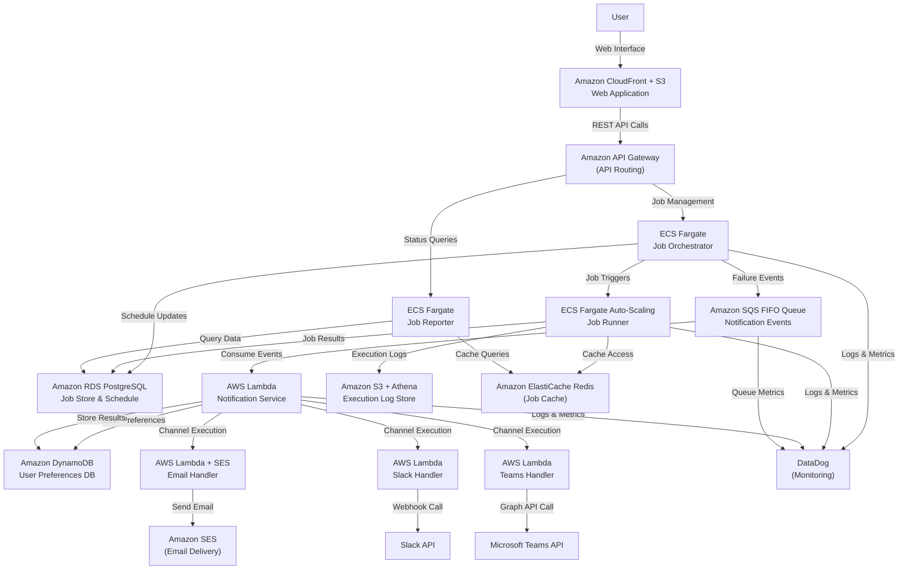

# Infrastructure Diagram

```mermaid
graph TD
    %% User Interaction Layer
    User["User"] -->|Web Interface| CloudFront["Amazon CloudFront + S3<br/>Web Application"]
    
    %% API Gateway Layer
    CloudFront -->|REST API Calls| APIGateway["Amazon API Gateway<br/>(API Routing)"]
    
    %% Backend Services Layer
    APIGateway -->|Job Management| JobOrchestrator["ECS Fargate<br/>Job Orchestrator"]
    APIGateway -->|Status Queries| JobReporter["ECS Fargate<br/>Job Reporter"]
    
    %% Job Execution Layer
    JobOrchestrator -->|Schedule Updates| RDS["Amazon RDS PostgreSQL<br/>Job Store & Schedule"]
    JobOrchestrator -->|Failure Events| SQS["Amazon SQS FIFO Queue<br/>Notification Events"]
    JobOrchestrator -->|Job Triggers| JobRunner["ECS Fargate Auto-Scaling<br/>Job Runner"]
    
    %% Notification Layer
    SQS -->|Consume Events| NotificationLambda["AWS Lambda<br/>Notification Service"]
    NotificationLambda -->|User Preferences| DynamoDB["Amazon DynamoDB<br/>User Preferences DB"]
    NotificationLambda -->|Channel Execution| EmailHandler["AWS Lambda + SES<br/>Email Handler"]
    NotificationLambda -->|Channel Execution| SlackHandler["AWS Lambda<br/>Slack Handler"]
    NotificationLambda -->|Channel Execution| TeamsHandler["AWS Lambda<br/>Teams Handler"]
    
    %% External Services
    EmailHandler -->|Send Email| SES["Amazon SES<br/>(Email Delivery)"]
    SlackHandler -->|Webhook Call| Slack["Slack API"]
    TeamsHandler -->|Graph API Call| Teams["Microsoft Teams API"]
    
    %% Data Storage & Cache
    JobRunner -->|Execution Logs| S3["Amazon S3 + Athena<br/>Execution Log Store"]
    JobRunner -->|Cache Access| ElastiCache["Amazon ElastiCache Redis<br/>(Job Cache)"]
    JobRunner -->|Job Results| RDS
    
    %% Monitoring & Observability
    JobOrchestrator -->|Logs & Metrics| CloudWatch["DataDog<br/>(Monitoring)"]
    JobRunner -->|Logs & Metrics| CloudWatch
    NotificationLambda -->|Logs & Metrics| CloudWatch
    SQS -->|Queue Metrics| CloudWatch
    
    %% Internal Service Communication
    JobReporter -->|Query Data| RDS
    JobReporter -->|Cache Queries| ElastiCache
    NotificationLambda -->|Store Results| DynamoDB
```
