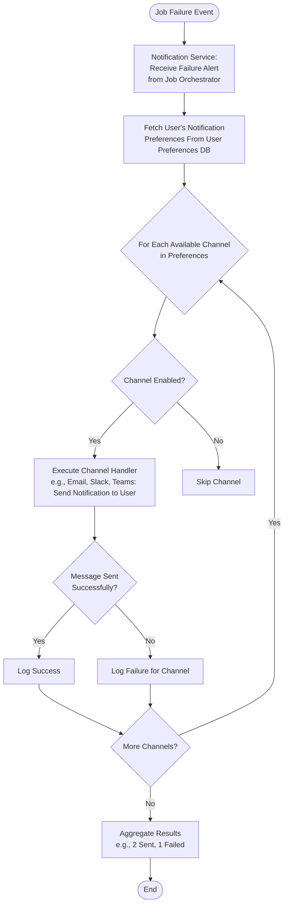

# Send notification for job failure - activity diagram

```mermaid
flowchart TD
    Start([Job Failure Event]) --> A[Notification Service: <br/>Receive Failure Alert<br/>from Job Orchestrator]

    A --> B[Fetch User's Notification<br/>Preferences From User Preferences DB]

    B --> C{For Each Available Channel<br/> in Preferences}

    C --> D{Channel Enabled?}
    D -->|Yes| E[Execute Channel Handler<br/>e.g., Email, Slack, Teams: Send Notification to User]
    D -->|No| F[Skip Channel]

    E --> G{Message Sent<br/>Successfully?}
    G -->|Yes| H[Log Success]
    G -->|No| I[Log Failure for Channel]

    H & I --> J{More Channels?}
    J -->|Yes| C
    J -->|No| K[Aggregate Results<br/>e.g., 2 Sent, 1 Failed]

    K --> M([End])
```
