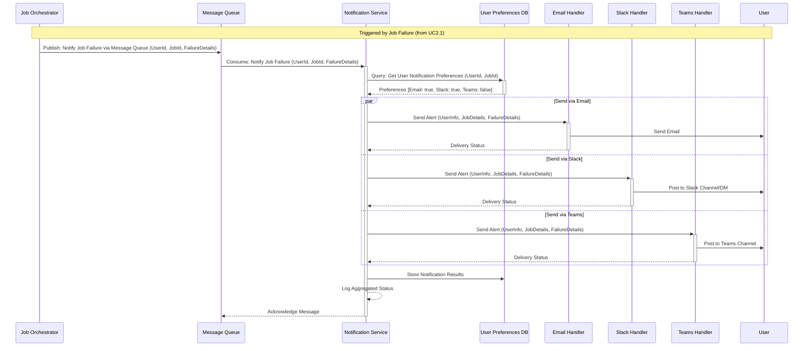

# Send notification for job failure - sequence diagram

```mermaid
sequenceDiagram
    participant O as Job Orchestrator
    participant MQ as Message Queue
    participant N as Notification Service
    participant DB as User Preferences DB
    participant E as Email Handler
    participant S as Slack Handler
    participant T as Teams Handler
    participant U as User

    Note over O, U: Triggered by Job Failure (from UC2.1)

    O->>MQ: Publish: Notify Job Failure via Message Queue (UserId, JobId, FailureDetails)
    
    MQ->>+N: Consume: Notify Job Failure (UserId, JobId, FailureDetails)
    
    N->>+DB: Query: Get User Notification Preferences (UserId, JobId)
    DB-->>-N: Preferences [Email: true, Slack: true, Teams: false]

    par Send via Email
        N->>+E: Send Alert (UserInfo, JobDetails, FailureDetails)
        E->>U: Send Email
        E-->>-N: Delivery Status
    and Send via Slack
        N->>+S: Send Alert (UserInfo, JobDetails, FailureDetails)
        S->>U: Post to Slack Channel/DM
        S-->>-N: Delivery Status
    and Send via Teams
        N->>+T: Send Alert (UserInfo, JobDetails, FailureDetails)
        T->>U: Post to Teams Channel
        T-->>-N: Delivery Status
    end

    N->>DB: Store Notification Results
    N-->>N: Log Aggregated Status
    N-->>-MQ: Acknowledge Message
```
